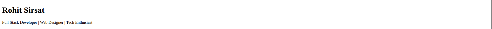
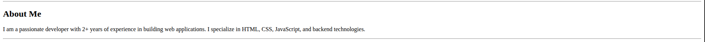
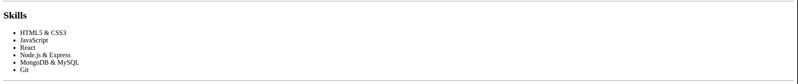
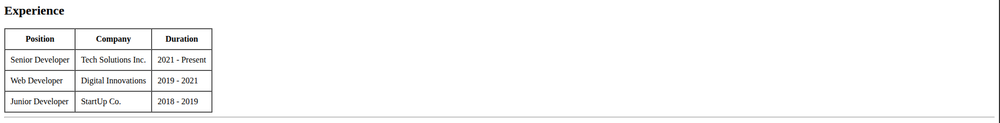
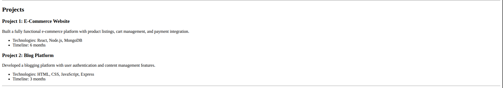
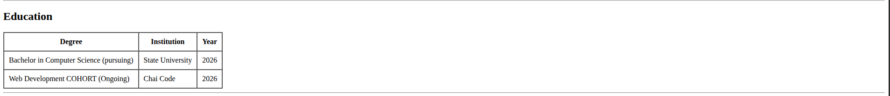
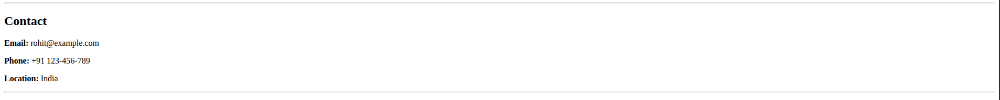
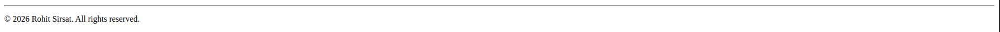

# Resume Website

A clean, single-page HTML resume website showcasing professional information including skills, experience, projects, education, and contact details.

## Project Overview

This project is a static HTML-based resume website built without any CSS framework dependencies. It uses semantic HTML elements and basic table structures with borders for a clean, professional layout. The resume is fully responsive and can be viewed on any device with a web browser.

## Features

- ✅ **Header Section** - Name and professional title
- ✅ **About Me** - Professional summary and background
- ✅ **Skills List** - Technical skills in a bulleted list format
- ✅ **Experience Table** - Professional experience with position, company, and duration
- ✅ **Projects Section** - Detailed project descriptions with technologies and timelines
- ✅ **Education Table** - Educational qualifications with institution and year
- ✅ **Contact Information** - Email, phone, and location details
- ✅ **Footer** - Copyright information

## File Structure

```
cohort2026/
├── resume.html          # Main resume website file
└── README.md           # This documentation file
```

## Setup Instructions

### Prerequisites

- A modern web browser (Chrome, Firefox, Safari, Edge, etc.)
- A text editor (optional, only if you want to edit the content)

### Steps

1. **Navigate to the project directory:**

   ```bash
   cd /home/rohit/Code/cohort2026
   ```

2. **Open the resume in your browser:**
   - **Option 1 (Direct):** Open the `resume.html` file in vs code then click the "Open with Live Server" button. (Make sure you have the Live Server extension installed.)

## Usage

### Viewing the Resume

1. Open `resume.html` in any web browser
2. Scroll through the page to view all sections
3. The page displays all content in a linear, easy-to-read format

## TECHNOLOGIES USED

- **HTML**

## Content Sections Breakdown

### 1. Header

- Professional name
- Job title and description
- Visual separator
  

### 2. About Me

- Professional summary
- Experience level
- Area of expertise
  

### 3. Skills

- Technical competencies
- Tools and languages
- Organized as bullet points
  

### 4. Experience

- Work history table
- Position titles
- Company names
- Employment duration
  

### 5. Projects

- Project descriptions
- Technologies used
- Timeline information
- Key achievements
  

### 6. Education

- Educational qualifications
- Institution names
- Graduation years
  

### 7. Contact

- Email address
- Phone number
- Location/City
  

### 8. Footer

- Copyright notice
- Copyright year
  

---

## License

© 2026 Resume Website. All rights reserved.

---

**Last Updated:** January 29, 2026
